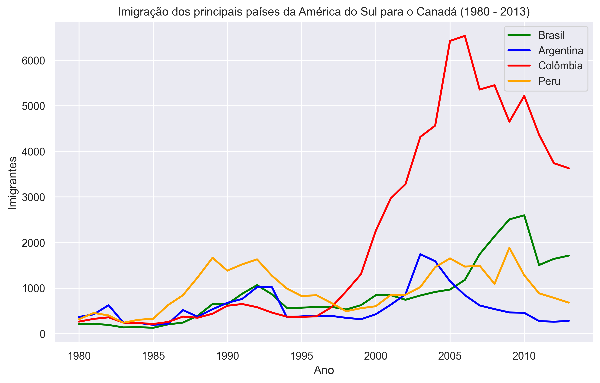

# 📊 Imigração para o Canadá (1980–2013)

Este projeto apresenta uma análise visual dos dados de imigração para o **Canadá** entre os anos de **1980 e 2013**, com recortes temáticos que incluem comparações por região, país de origem e tendências históricas. Utilizando Python e bibliotecas de visualização de dados, o objetivo é tornar as informações mais acessíveis e interpretáveis, revelando padrões migratórios ao longo do tempo.



---

## 🔍 Tópicos abordados

- 📈 Evolução total da imigração por ano
- 🌎 Comparação entre continentes/regiões
- 🇧🇷 Comparativo entre países da América do Sul (Brasil, Argentina, Colômbia, Peru)
- 📊 Rankings dos países com maior número de imigrantes
- 🧭 Análise de tendências e picos históricos

---

## 📁 Fonte dos Dados

Os dados foram disponibilizados pelo **Kaggle**, contendo registros anuais do número de imigrantes por país de origem.  
Fonte original: *https://www.kaggle.com/datasets/ammaraahmad/immigration-to-canada*.

---

## 🛠️ Tecnologias utilizadas

- **Python 3.9+**
- **Pandas** — manipulação e análise de dados
- **Matplotlib** — gráficos estáticos
- **Seaborn** — visualização estilizada
- **Plotly** *(opcional)* — gráficos interativos
- **Jupyter Notebook** — organização e apresentação dos insights

---

## ▶️ Como rodar o projeto

1. Clone este repositório:
   ```bash
   git clone https://github.com/seu-usuario/imigracao-canada.git
   cd imigracao-canada
